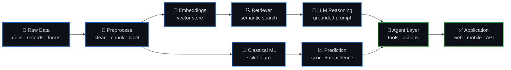
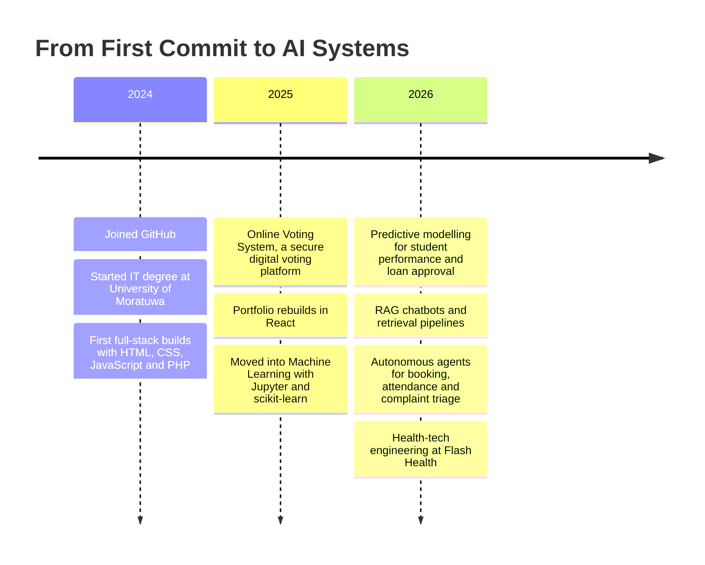

<h1 align="center">
<a href="https://git.io/typing-svg">

</a><br>


</h1>

<div align="center">

<a href="https://git.io/typing-svg">

</a>

<br><br>


<a href="https://github.com/Amryahmath?tab=followers"></a>


<br><br>

<a href="#-about-me"></a>
<a href="#-tech-arsenal"></a>
<a href="#-featured-projects"></a>
<a href="#-github-analytics"></a>
<a href="#-my-journey"></a>
<a href="#-connect-with-me"></a>

</div>

---

## 🧭 About Me

<div align="center">

</div>

I'm an **IT undergraduate at the University of Moratuwa**, Sri Lanka, currently working at
**Flash Health** and spending most of my free cycles on **Data Science, Machine Learning
and applied AI**.

My work sits at the intersection of *practical software* and *intelligent systems* —
retrieval-augmented chatbots, autonomous scheduling agents, predictive models for
education and finance, and the full-stack apps that put them in front of real users.

- 🔭 &nbsp;Currently building **AI agents & RAG pipelines** in Python
- 🌱 &nbsp;Deepening my grounding in **Data Science, ML and Artificial Intelligence**
- 🎓 &nbsp;Also pursuing an **English Diploma @ Aquinas College**
- ⚡ &nbsp;Fun fact: **I pick things up fast — and I break them faster to learn how they work**
- 📫 &nbsp;Reach me at **amryahmath01@gmail.com**

<details>
<summary><b>💻 &nbsp;My developer profile, as code</b></summary>

<br>

```python
class AmryAhmath:
    """IT undergraduate • AI/ML practitioner • Sri Lanka"""

    def __init__(self):
        self.name        = "Amry Ahmath"
        self.role        = "IT Undergraduate & AI/ML Enthusiast"
        self.university  = "University of Moratuwa, Sri Lanka"
        self.company     = "Flash Health"
        self.languages   = ["Python", "Java", "JavaScript", "TypeScript", "PHP", "C", "C++"]
        self.focus       = ["RAG Systems", "AI Agents", "Predictive Modelling", "Full-Stack"]
        self.learning    = ["Deep Learning", "MLOps", "Cloud-Native AI"]

    def current_mission(self) -> str:
        return "Turn messy, real-world data into systems people actually rely on."

    def say_hi(self) -> str:
        return "Thanks for dropping by — let's build something intelligent. 🚀"


me = AmryAhmath()
print(me.say_hi())
```

</details>

---

## 🎯 What I'm Building Right Now

<div align="center">

| &nbsp; | Focus Area | What It Means In Practice |
|:--:|:--|:--|
| 🤖 | **Autonomous Agents** | Appointment booking, clock-in/out and complaint-triage agents that act, not just answer |
| 🔍 | **RAG & LLM Systems** | Grounding language models in real documents so answers are traceable, not hallucinated |
| 📈 | **Predictive Modelling** | Student performance and loan approval models — classic ML done properly, end to end |
| 🏥 | **Health-Tech** | Prescription and consultation validation tooling at **Flash Health** |
| 🌐 | **Full-Stack Delivery** | React / Angular / Flutter front-ends over PHP & Python services |

</div>

---

## 🧩 Tech Arsenal

<div align="center">

### Languages


### Frontend & Mobile


### Data Science & AI


### Cloud, Design & Tooling


### 🌱 Currently Levelling Up


</div>

---

## 🧠 AI Engineering Stack

> How I think about building an AI feature — from raw documents to something a user can trust.



<div align="center">

**Retrieval keeps it honest · Classical ML keeps it measurable · Agents make it useful**

</div>

---

## 📌 Featured Projects

<table>
<tr>
<td width="50%" valign="top">

### 🤖 [RAG Chat Bot](https://github.com/Amryahmath/RAG-Chat-Bot)

Retrieval-augmented chatbot that grounds LLM answers in a real document corpus instead of guessing.


</td>
<td width="50%" valign="top">

### 🗳️ [Online Voting System](https://github.com/Amryahmath/Online-Voting-System-)

A secure and efficient digital voting platform — authentication, ballot integrity and result tallying.


</td>
</tr>
<tr>
<td width="50%" valign="top">

### 📊 [Student Performance Predictor](https://github.com/Amryahmath/Student-Performance-Predictor)

Machine learning project predicting academic outcomes — full pipeline from feature engineering to evaluation.


</td>
<td width="50%" valign="top">

### 💰 [Loan Approval Prediction](https://github.com/Amryahmath/Loan_Approval_Prediction)

Classification model for credit decisioning, with the messy real-world preprocessing that makes or breaks it.


</td>
</tr>
<tr>
<td width="50%" valign="top">

### 📮 [UC Complaint Management AI](https://github.com/Amryahmath/UC-Complain-Management-AI)

AI-assisted complaint intake and triage — classify, route and prioritise incoming reports automatically.


</td>
<td width="50%" valign="top">

### 📅 [Appointment Booking AI Agent](https://github.com/Amryahmath/Appointment-booking-Ai-agent)

Conversational agent that takes a booking request end to end — availability, confirmation, follow-up.


</td>
</tr>
</table>

<details>
<summary><b>📂 &nbsp;More from the workshop</b></summary>

<br>

| Project | What It Does | Stack |
|:--|:--|:--|
| [Clock-in-out-Agent-](https://github.com/Amryahmath/Clock-in-out-Agent-) | Conversational agent handling employee attendance workflows | `AI Agent` |
| [consultation-prescription-validation-](https://github.com/Amryahmath/consultation-prescription-validation-) | Validation layer for medical consultations and prescriptions | `Python` |
| [prescription](https://github.com/Amryahmath/prescription) | Prescription handling and processing service | `Python` |
| [Brand-Store-Mobile-Application](https://github.com/Amryahmath/Brand-Store-Mobile-Application) | Cross-platform storefront app for a retail brand | `TypeScript` |
| [property-Search-](https://github.com/Amryahmath/property-Search-) | Property listing and search experience | `JavaScript` |
| [My-Portfolio](https://github.com/Amryahmath/My-Portfolio) | Portfolio showcasing development skills and projects | `CSS` `HTML` |
| [react-portfolio](https://github.com/Amryahmath/react-portfolio) | Component-driven portfolio rebuild in React | `React` `CSS` |
| [Volt-Vision-My](https://github.com/Amryahmath/Volt-Vision-My) | EV adoption information platform for Sri Lanka | `Web` |
| [ui-test-automation-group-10](https://github.com/Amryahmath/ui-test-automation-group-10) | UI test automation coursework project | `Testing` |
| [opencode-test](https://github.com/Amryahmath/opencode-test) | Experiments and scratch work | `TypeScript` |

</details>

<div align="center">
<br>
<a href="https://github.com/Amryahmath?tab=repositories">

</a>
</div>

---

## 📊 GitHub Analytics

<div align="center">


<br><br>


<br>


<br><br>


</div>

### 🏆 Trophy Cabinet

<div align="center">

<a href="https://github.com/ryo-ma/github-profile-trophy">

</a>

</div>

---

## 🐍 Contribution Snake

<div align="center">

<picture>
<source media="(prefers-color-scheme: dark)" srcset="https://raw.githubusercontent.com/Amryahmath/Amryahmath/output/github-snake-dark.svg" />
<source media="(prefers-color-scheme: light)" srcset="https://raw.githubusercontent.com/Amryahmath/Amryahmath/output/github-snake.svg" />

</picture>

<sub><i>Redrawn every 12 hours by a GitHub Action — see <code>.github/workflows/snake.yml</code></i></sub>

</div>

---

## 📅 My Journey



<details>
<summary><b>🎖️ &nbsp;Achievements & Highlights</b></summary>

<br>

| Highlight | Detail |
|:--|:--|
| 🏛️ **University of Moratuwa** | Reading for an IT degree at Sri Lanka's leading engineering university |
| 💼 **Flash Health** | Applying software and AI engineering in a real health-tech environment |
| 🗳️ **Online Voting System** | Most-starred project — a secure, efficient digital voting platform |
| 🧠 **AI Agent Portfolio** | Multiple shipped agents: appointment booking, attendance, complaint management |
| 📊 **End-to-End ML** | Two complete prediction pipelines from raw data to evaluated model |
| 🎓 **English Diploma** | Aquinas College — because clear communication ships better software |

<!-- TODO: Add HackerRank badges, hackathon placements, dean's list, or course awards here. -->

</details>

<details>
<summary><b>📜 &nbsp;Certifications</b></summary>

<br>

<!--
  TODO — replace the rows below with your real certifications.
  Suggested badge format:
  
-->

| Certification | Issuer | Year |
|:--|:--|:--:|
| _Add your certification_ | _Issuer_ | _Year_ |
| _Add your certification_ | _Issuer_ | _Year_ |

<div align="center">
<a href="https://www.hackerrank.com/@techk4218">

</a>
</div>

</details>

---

## 🌱 Currently Learning

<div align="center">

| Track | Where I'm At |
|:--|:--|
| 🧠 **Deep Learning** | Neural network fundamentals → TensorFlow & PyTorch in practice |
| 🔗 **LLM Engineering** | Prompt design, retrieval strategy, evaluation and guardrails |
| ☁️ **Cloud & MLOps** | Getting models off the notebook and into deployed services on AWS |
| 📐 **System Design** | Designing software that stays maintainable past the first release |
| 🗣️ **English Diploma** | Aquinas College — communication as an engineering skill |

</div>

---

## 🔗 Connect With Me

<div align="center">

<a href="mailto:amryahmath01@gmail.com">

</a>
<a href="https://portfolio-873783609.development.catalystserverless.com/app/index.html">

</a>
<a href="https://www.hackerrank.com/@techk4218">

</a>
<a href="https://instagram.com/mm_amry">

</a>
<a href="https://github.com/Amryahmath">

</a>

<!--
  TODO — add these once you have the links:
  <a href="https://linkedin.com/in/YOUR-HANDLE"></a>
  <a href="https://kaggle.com/YOUR-HANDLE"></a>
  <a href="https://x.com/YOUR-HANDLE"></a>
-->

<br><br>

**Open to collaborating on AI/ML projects, open-source work, and anything that makes data useful.**

</div>

---

<div align="center">

<i>"The best way to predict the future is to build it — then measure whether it works."</i>

<br><br>

⭐ &nbsp;**If something here was useful, a star on a repo goes a long way.**


</div>
